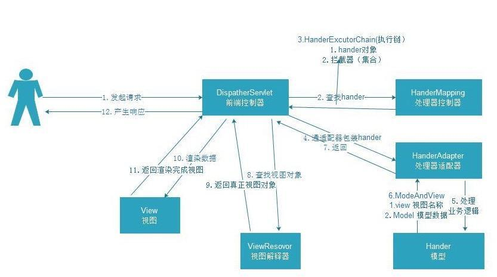

# SpringMVC 运行机制
## 1. SpringMVC原理

- SpringMVC请求流程,一般分为12个步骤:
  - 1.用户发起请求,由前端控制器DispatcherServlet处理;
  - 2.前端控制器通过处理器映射器查找handler,可以根据XML或者注解去找;
  - 3.处理器映射器返回执行链;
  - 4.前端控制器请求处理器适配器来执行handler;
  - 5.处理器适配器来执行handler
  - 6.处理业务完成之后,会给处理器适配器返回ModelAndView对象,其中有视图名称,模型数据;
  - 7.处理器适配器将视图名称和模型数据返回给前端控制器;
  - 8.前端控制器通过视图解析器来对视图进行解析;
  - 9.视图解析器返回真正的视图给前端控制器;
  - 10.前端控制器通过返回的视图和数据进行渲染;
  - 11.返回渲染完成的视图;
  - 12.将最终的视图返回给用户,产生响应;

## 2. 转发和重定向区别
```
 https://www.cnblogs.com/fifiyong/p/5949689.html
```