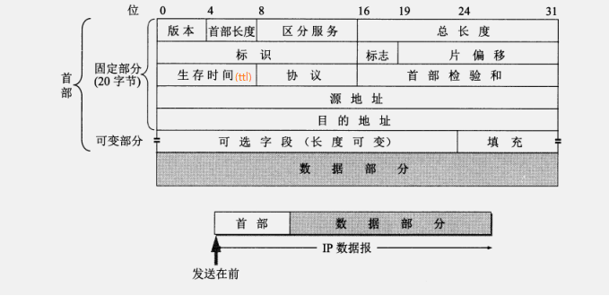
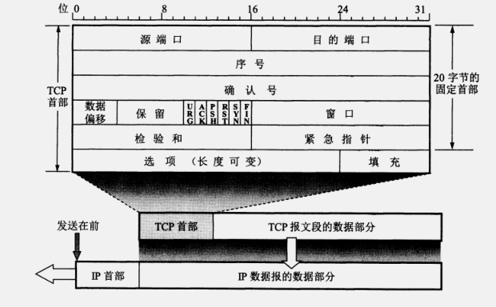
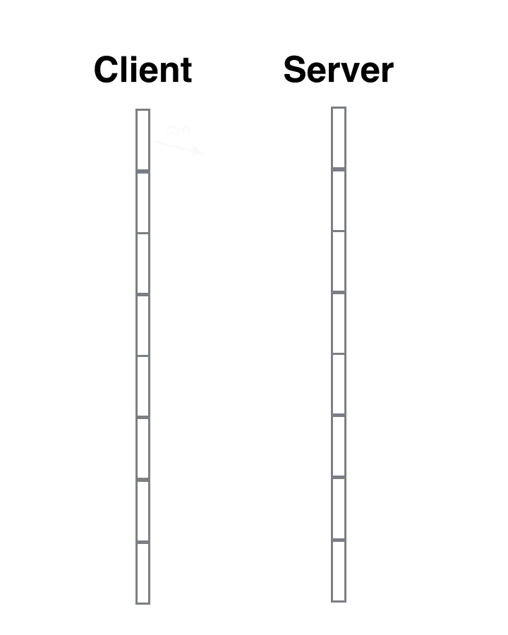

<!-- GFM-TOC -->
* [1. TCP/IP协议介绍](#1-tcp/ip协议介绍)
* [2. IP数据报格式](#2-ip数据报格式)
* [3. TCP数据报格式](#3-tcp数据报格式)
* [4. TCP三次握手和四次挥手](#4-tcp三次握手和四次挥手)
  * [4.1 TCP三次握手](#41-tcp三次握手)
<!-- GFM-TOC -->

# 1. TCP/IP协议介绍

   - 中译名为传输控制协议/因特网互联协议，又名网络通讯协议，是Internet最基本的协议、Internet
    国际互联网络的基础，由网络层的IP协议和传输层的TCP协议组成。

   - TCP负责发现传输的问题，一有问题就发出信号，要求重新传输，直到所有数据安全正确地传输到目的地。
    而IP是给因特网的每一台联网设备规定一个地址。

   - TCP提供的是一种可靠的数据流服务，采用“带重传的肯定确认”技术来实现传输的可靠性。TCP还采用一种
    称为“滑动窗口”的方式进行流量控制，所谓窗口实际表示接收能力，用以限制发送方的发送速度。

   - IP数据包是不可靠的，因为IP并没有做任何事情来确认数据包是否按顺序发送的或者有没有被破坏。

# 2. IP数据报格式

ip数据报格式如下图：



   - 这里重点说明一下其中一个关键的词，生存时间！正式由于生存时间TTL的存在，才确定IP协议是不可靠传输。

   - 最初的设计是以秒作为 TTL的单位。每经过一个路由器时，就把TTL减去数据报在路由器消耗掉的一段时间。若数据报在路由器消耗的时间小于 1 秒，就把TTL值减 1。当 TTL值为 0时，就丢弃这个数据报。

   - 所以这就是其不可靠的缘由，其他名词不做详细解释。

# 3. TCP数据报格式

tcp数据报格式如下图：



   - 32位序号：一次TCP通信过程中某一个传输方向上的字节流的每个字节的编号，通过这个来确认发送的数据有序，比如现在序列号为1000，发送了1000，下一个序列号就是2000。

   - 32位确认号：用来响应TCP报文段，给收到的TCP报文段的序号加1，三握时还要携带自己的序号。

   - 6位保留。6位标志。URG（紧急指针是否有效）ACK（表示确认号是否有效）PSH（提示接收端应用程序应该立即从TCP接收缓冲区读走数据）RST（表示要求对方重新建立连接）SYN（表示请求建立一个连接）FIN（表示通知对方本端要关闭连接）

   - 16位窗口大小：TCP流量控制的一个手段，用来告诉对端TCP缓冲区还能容纳多少字节。

   - 16位校验和：由发送端填充，接收端对报文段执行CRC算法以检验TCP报文段在传输中是否损坏。

   - 16位紧急指针：一个正的偏移量，它和序号段的值相加表示最后一个紧急数据的下一字节的序号。
   
# 4. TCP三次握手和四次挥手
## 4.1 TCP三次握手
```
   TCP三次握手就好比两个人在街上隔着50m看到了对方,但是因为雾霾等原因不能100%确认,
   所以要通过招手的方式相互确定对方是否认识自己.
```

